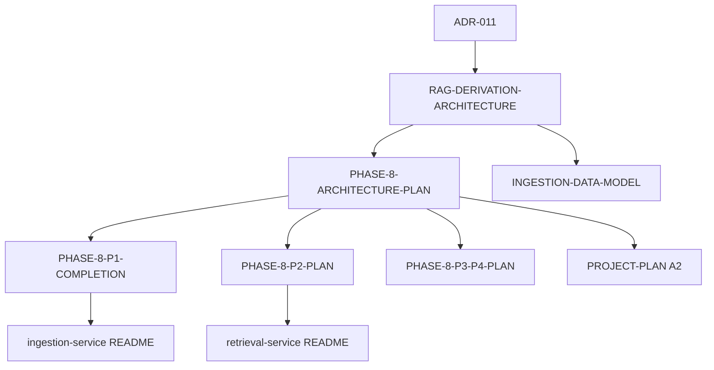

# Phase 8 — Architecture plan (master source)

**Status:** **PHASE 8 COMPLETE ✅** · P1 ✅ · P2 ✅ · P3 ✅ · G2+G3+G4 pass  
**Spec (normative detail):** [RAG-DERIVATION-ARCHITECTURE.md](RAG-DERIVATION-ARCHITECTURE.md)  
**ADR:** [011](../adr/011-rag-derivation-architecture.md) · **Approved:** D-25, D-26, D-27  
**Consumer manifest:** `geostat.ops.json` → `modules.ingestion.derivation`, `modules.chat-api.catalog`

---

## 1. როლი ამ დოკის

| დოკი | როლი |
|------|------|
| **ეს ფაილი (master)** | Phase 8 roadmap, phase gates, doc map, dependency graph |
| [RAG-DERIVATION-ARCHITECTURE.md](RAG-DERIVATION-ARCHITECTURE.md) | Normative spec — schema, APIs, thresholds, risks |
| [PHASE-8-P1-ARCHITECTURE-COMPLETION.md](PHASE-8-P1-ARCHITECTURE-COMPLETION.md) | P1 Senior completion — layers, SOLID, cutover FSM |
| [PHASE-8-P2-ARCHITECTURE-PLAN.md](PHASE-8-P2-ARCHITECTURE-PLAN.md) | P2 retrieval quality — U08–U11 |
| [PHASE-8-P3-P4-ARCHITECTURE-PLAN.md](PHASE-8-P3-P4-ARCHITECTURE-PLAN.md) | P3 ops/polish, P4+ defer, zero-gap exit |
| [PROJECT-PLAN.md](PROJECT-PLAN.md) §A2 | Status table + owner sequence |

**წესი:** კოდის ცვლილება → spec + phase plan + CHANGELOG; ახალი capability → port/adapter ჯერ, manifest/env მეორე.

---

## 2. Phase map (approved)

```text
                    ┌─────────────────────────────────────┐
                    │  Eval gate (U12) — mandatory gate   │
                    └─────────────────────────────────────┘
         P1 Foundation          P2 Retrieval           P3 Ops/Polish
    U01a-h, U02, U07*, U12   U08, U09, U10, U11    U13, U14, U05 UI
    V9-V16, cutover S0-S7    Qdrant v2, hybrid      feedback, cache
    yaml coexist → derived   query flags ON           YAML delete (S7)
         │                        │                        │
         └────────────────────────┴────────────────────────┘
                              P4+ (deferred)
                         U15 KG, P8-plan-01, B-37 split
```

| Phase | RAG-U | Gate to start | Gate to complete |
|-------|-------|---------------|------------------|
| **P1** | U01a–h, U02, U07*, U12 | ADR-011 accepted | S6 eval pass + derived catalog live |
| **P2** | U08–U11 | P1 eval pass | U12 regression pass with P2 flags ON |
| **P3** | U13, U14, U05 UI, YAML exit | P2 eval pass | YAML deleted; overlay UI live |
| **P4+** | U15, service split | Scale/eval triggers | ADR if approved |

\* U07 implemented P1; **runtime flags OFF** until P1 eval pass.

---

## 3. Layer architecture (L1–L5)

```text
L1 Corpus          ingestion: crawl|parse|chunk|index
L2 Enrichment      ingestion: enrichment/* + platform-contracts ports
L3 Aggregation     ingestion: catalog/* MVs + topic_cluster
L4 Curation        ingestion: curation/* overlay (≤50)
L5 Online query    chat-api: query understanding + retrieval orchestration
                   retrieval-service: Qdrant/BM25 search adapters
```

**Single pipeline (zero-gap):** `ingestion → Postgres/Qdrant → retrieval ← chat-api`. No parallel crawl or YAML truth after S7.

---

## 4. Deployable boundaries (ADR-009 + D-27)

| Deployable | Owns | Must not own |
|------------|------|--------------|
| **ingestion-service** | L1–L4, eval query storage, readiness | chat prompts, user sessions |
| **retrieval-service** | vector/BM25 search, rerank adapters | crawl, Gemini generation |
| **chat-api** | L5 query pipeline, catalog read (yaml\|derived), chat | corpus write, MV refresh |
| **frontend** | UI, admin curation tab (P3) | business rules |

**Future split (B-37 / P8-plan-01):** extract packages only when **observed** triggers fire — not Phase 8 default.

---

## 5. Manifest & ops contract

```text
geostat.ops.json
├── modules.ingestion.derivation     P1 env names, cutover CI refs
├── modules.chat-api.catalog         source flip, presentation YAML allowlist
├── modules.retrieval                (P2: collection v2 env — see P2 plan)
└── ci.*                             ragP1Cutover, ragEvalGate, …
```

Secrets: `ops/config/<module>/.env.*` only. Presentation: `topic-style.yaml`, `terminology-overlay.yaml` — **never** deleted.

---

## 6. Eval gates (cross-phase)

| Gate | When | Pass criteria | Script |
|------|------|---------------|--------|
| **G0** | P1 start | YAML baseline frozen | `rag-eval-freeze-yaml-baseline.ps1` |
| **G1** | P1 cutover | readiness checks green | `derivation-readiness` API |
| **G2** | P1 done | derived hit@5 ≥ YAML −5% | `rag-eval-gate.ps1` |
| **G3** | P2 rollout | no >5% regression any metric | `run-eval.py` |
| **G4** | YAML delete | G2 + G3 + owner OK | manual + grep legacy |

Baselines: `ops/eval/baseline.yaml-frozen.json` → `baseline.derived.json` after G2.

---

## 7. Document dependency graph



---

## 8. Completion status (plan vs code vs runtime)

| Area | Plan source | Code | Runtime |
|------|-------------|------|---------|
| P1 Foundation | **100%** | **100%** | **100% ✅** (G2 pass) |
| P2 Retrieval | **100%** | **100% ✅** | **100% ✅** (G3 pass) |
| P3 Ops/Polish | **100%** | **100% ✅** | **100% ✅** (G4 pass) |
| P4+ Deferred | **100%** | deferred | — |
| Zero-gap exit (S7) | **100%** | **done** | **done ✅** |

**PHASE 8 COMPLETE** (2026-05-26): G2 + G3 + G4 eval pass, derived catalog live, YAML deleted.

---

## 9. Owner runbook (sequence only)

1. P1 runtime S0–S6 → [P1 completion §7](PHASE-8-P1-ARCHITECTURE-COMPLETION.md#7-cutover-state-machine-runtime--remaining-work)
2. P2 implement U08→U11 per [P2 plan](PHASE-8-P2-ARCHITECTURE-PLAN.md) → G3
3. P3 U13/U14/UI + S7 YAML delete per [P3-P4 plan](PHASE-8-P3-P4-ARCHITECTURE-PLAN.md)
4. P8-plan-01 review after P3 + 30d telemetry

Orchestrator: `.\ops\ci\rag-p1-cutover.ps1 -Step status|prep|gate`

---

## 10. Verification — plan source sign-off

- [x] ADR-011 + D-25/D-26/D-27 in approved/
- [x] Normative spec sections 1–19 complete
- [x] P1 completion doc (layers, SOLID, FSM)
- [x] P2 plan (U08–U11 packages, migration, flags)
- [x] P3/P4 plan (U13–U15, YAML exit, P8-plan-01)
- [x] PROJECT-PLAN §A2 synced
- [x] Manifest derivation + catalog blocks
- [x] BACKLOG cross-refs (B-37, P0-config-enrichment)
- [ ] Runtime P1–P3 (implementation, not plan)

---

*Last updated: 2026-05-26 — **PHASE 8 COMPLETE**. P1+P2+P3 done, G2+G3+G4 pass, YAML deleted, hybrid retrieval ready.*
